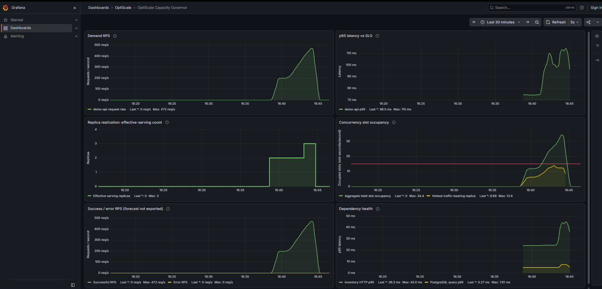

# OptiScale

### Explainable Kubernetes Capacity Governor

OptiScale is an SLO-aware, dependency-aware Kubernetes capacity governor that determines whether adding horizontal replicas will increase useful application capacity, where the limiting component is, and what action is safest under uncertainty.

> **Will another replica create useful capacity — and if so, where?**

OptiScale combines workload SLOs, local saturation, dependency health, Kubernetes state, and observed traffic-bearing capacity. Demand forecasting is one optional policy input, not the product itself. OptiScale is not simply an HPA with a latency trigger, and it does not use opaque machine learning. HPA and KEDA remain appropriate for many workloads; a stateless service with a well-calibrated local scaling policy may not need OptiScale.

## The problem

High latency does not, by itself, show that the current workload needs more replicas. The constraint may be a downstream service or a dependency such as PostgreSQL that is not permitted to scale. Adding upstream replicas in that situation can leave end-to-end capacity unchanged while increasing pressure on the constrained component.

Kubernetes readiness also does not prove that a pod is receiving meaningful traffic. Connection reuse or traffic-distribution behavior can plausibly delay useful traffic reaching a newly Ready endpoint. Predictive scaling has its own risks: stale, sparse, noisy, or incomplete telemetry can make a forecast unsafe, and requested capacity may not yet be serving useful work.

OptiScale is most useful when a capacity decision needs to combine SLO telemetry, target saturation, dependency health, request throughput and errors, Kubernetes workload state, effective-serving replicas, readiness latency, telemetry quality, and optionally a forecast. It is not intended to replace every workload-local autoscaler.

## Useful capacity, not replica count

**Requested replicas != Ready replicas != useful traffic-bearing capacity.** OptiScale derives <code>effectiveServingReplicas</code> from recent per-instance request telemetry. Realized safe capacity is credited only to replicas with meaningful observed traffic.

If a Deployment has 3 Ready replicas but only 2 are traffic-bearing, the third replica is not counted as fully realized application capacity. OptiScale holds further target scale-ups or prescaling while the previously requested capacity is still becoming useful; it does not blindly continue from 3 -> 4 -> 5.

## Architecture

~~~mermaid
flowchart LR
  subgraph workload[Workload path]
    traffic[Incoming traffic / k6] --> api[demo-api]
    api --> inventory[inventory-service]
    inventory --> postgres[PostgreSQL]
  end

  prometheus[Prometheus] --> observe[Observation layer]
  api -. /metrics .-> prometheus
  inventory -. HTTP and database-query metrics .-> prometheus
  kubeapi[Kubernetes API: Deployments, Scale, Pods, ReplicaSets] --> observe

  subgraph controller[OptiScale controller]
    observe --> analyzer[Capacity analyzer]
    analyzer --> policy[Policy engine]
    analyzer -. healthy target and valid inputs .-> forecast[Optional OLS forecast]
    forecast -. advisory input .-> policy
    policy --> guards[Safety guardrails]
  end

  guards --> scale[Deployment /scale]
  scale --> kubeapi
  guards --> explain[OptiScaler status / DecisionRecord / Events / logs]
  prometheus --> grafana[Grafana visualization]
~~~

Prometheus supplies timestamped application observations; the Kubernetes API supplies requested and Ready replica state plus pod/revision readiness evidence. The controller analyzes the target and configured dependencies, applies deterministic policy and bounds, and uses the Kubernetes Deployment <code>/scale</code> subresource when a replica change is warranted. Decision details are exposed in OptiScaler status, Kubernetes Events, and structured logs. Grafana reads Prometheus separately and is not part of the controller decision loop.

See [Architecture](docs/architecture.md) for component interactions and [Metrics and policy](docs/metrics-and-policy.md) for exact PromQL, thresholds, and model details.

## How OptiScale makes a decision

The controller evaluates target p95 against its SLO, target concurrency-slot occupancy, request and successful-request rates, error ratio, effective-serving count, requested and Ready replicas, configured dependency telemetry and scalability policy, readiness evidence, and telemetry freshness. Prediction is optional.

| Classification | Meaning | Typical action |
| --- | --- | --- |
| <code>HEALTHY</code> | Target p95 is within its SLO; dependency activity alone does not trigger a reactive scale while user latency is healthy. | <code>HOLD</code>; prescaling is considered only if dependencies also pass their health gates. |
| <code>TARGET_SATURATED</code> | Target p95 violates its SLO and the hottest traffic-bearing target replica reaches the safe occupancy boundary. | Bounded <code>SCALE_TARGET</code>. |
| <code>DEPENDENCY_SATURATED</code> | Target p95 violates its SLO, target-local saturation does not explain it, and a configured scalable dependency is saturated. | Bounded <code>SCALE_DEPENDENCY</code>. |
| <code>CAPACITY_BLOCKED</code> | A non-scalable root dependency is the measured bottleneck. | <code>HOLD</code>; upstream scale actions are rejected. |
| <code>UNCERTAIN</code> | Required configuration or telemetry is incomplete, invalid, or ambiguous. | <code>PROTECTED_MODE</code>; preserve current replicas. |

<code>CAPACITY_BLOCKED</code> is a classification, not a separate action. <code>PRESCALE_TARGET</code> can replace only a healthy <code>HOLD</code>; target saturation, dependency decisions, blocked capacity, protected mode, cooldown, and bounds take precedence. A <code>HOLD</code> with no replica change causes no <code>/scale</code> write. The full decision order is in [Metrics and policy](docs/metrics-and-policy.md).

## Key system behaviors

### Target saturation

When target p95 is above its SLO and the hottest traffic-bearing replica reaches the configured safe operating occupancy, OptiScale identifies the target as locally saturated and may scale its Deployment by a bounded step. Hottest-replica occupancy avoids hiding one constrained instance behind idle or lightly loaded Ready replicas.

### Dependency bottleneck

When target latency is high but target-local saturation does not explain it, OptiScale evaluates configured dependencies. A saturated scalable dependency can be selected for <code>SCALE_DEPENDENCY</code>. The database scenario uses a real PostgreSQL Deployment and deterministic SQL <code>pg_sleep</code> delay. PostgreSQL is configured non-scalable; when its measured query latency/active work identify it as the root bottleneck, OptiScale classifies <code>CAPACITY_BLOCKED</code>, chooses <code>HOLD</code>, rejects target and dependency scaling, and leaves upstream replica counts unchanged. More <code>demo-api</code> replicas do not add PostgreSQL query capacity.

### Capacity realization

The traffic-distribution scenario exercises the case where Kubernetes reports 3 Ready target replicas while recent request telemetry shows only 2 effective-serving replicas. OptiScale holds further target scaling until useful capacity is observed. Connection reuse or traffic-distribution behavior can plausibly delay traffic to a new endpoint; the available evidence does not identify a specific network or kube-proxy cause.

## Predictive prescaling

The optional forecast is ordinary least-squares regression over a bounded recent request-rate history. It forecasts demand at a planning horizon composed of measured Pod creation-to-Ready time, a 15-second control-loop allowance, and half of the configured predictive request-rate window (15 seconds for the sample's 30-second query). The model requires at least five recent samples spanning 60 seconds, fresh and sufficiently close observations, a positive slope, and <code>HIGH</code> fit quality (<code>R^2 >= 0.95</code>, normalized RMSE <code><= 0.10</code>). Only the trailing 120 seconds are used for fitting; retained history is bounded to 20 samples over five minutes.

The forecast may prescale only when the target is otherwise healthy, dependencies are healthy, the forecast is trusted, empirical safe capacity is available, previously requested replicas are Ready and traffic-bearing, and projected demand exceeds realized current safe capacity within the planning horizon. Bounds, one-step scaling, and cooldown still apply. Weak, stale, noisy, or incomplete forecasts are rejected; this is intended safe behavior, not a reactive policy change. The model and capacity calculation are detailed in [Metrics and policy](docs/metrics-and-policy.md).

## Runtime proof

*Dashboard from the recorded Minikube predictive run: demand ramp, p95 against the 250 ms SLO, effective-serving replicas, concurrency occupancy, success/error RPS, and inventory/PostgreSQL health. Grafana visualizes Prometheus data; it does not supply controller decisions.*

The latest recorded successful predictive run (2026-09-12) used a controlled 200 -> 480 RPS k6 profile. It does not establish behavior for every production traffic pattern.

| Measurement | Result |
| --- | --- |
| Decision | <code>PRESCALE_TARGET</code>, <code>demo-api</code> 2 -> 3 replicas |
| Target p95 at decision / SLO | 107.86 ms / 250 ms |
| Predictive demand / forecast at horizon | 369.82 / 448.21 RPS |
| Realized safe capacity before scale | 433.45 RPS |
| Forecast quality | HIGH; <code>R^2</code> 0.999869; normalized RMSE 0.004; slope +1.540 RPS/s^2 |
| Planning horizon | 51 s = 21 s measured readiness + 15 s control-loop allowance + 15 s demand observation lag |
| Capacity realization | Third replica became Ready below SLO and later traffic-bearing; final requested / Ready / effective-serving count: 3 / 3 / 3 |
| k6 result | 104,796 requests; 0 dropped iterations; 0 HTTP failures; overall p95 101.52 ms |

The observed sequence was: healthy target -> sustained demand trend -> learned safe capacity -> forecast above realized safe capacity within the planning horizon -> <code>PRESCALE_TARGET</code> from 2 to 3 -> third replica Ready and traffic-bearing -> increased realized capacity -> controller <code>HOLD</code> at 3. These measurements show the behavior in this run; they do not establish that an outage was prevented or prove an unmeasured cause.

## Observability and explainability

OptiScaler status exposes the latest <code>DecisionRecord</code> and the most recent scaling decision. Records can include classification, target and dependency measurements, selected and rejected actions, requested/Ready/effective-serving counts, capacity estimates, forecast quality, readiness evidence, and the reason for the decision. Kubernetes Events distinguish target, dependency, and predictive scale actions; controller logs are structured. Grafana is a visualization companion, not the source of truth for policy decisions. Requested and Ready replica counts are inspected through Kubernetes because this Prometheus setup does not deploy kube-state-metrics.

## Safety behavior

- Invalid, stale, or incomplete required target/dependency telemetry produces <code>UNCERTAIN</code> / <code>PROTECTED_MODE</code>; it is not treated as zero.
- Missing/stale predictive telemetry or a poor-quality forecast suppresses prescaling; it does not silently substitute the stable request-rate query. Invalid required configuration is protected.
- Ambiguous target rollout/readiness evidence blocks prescaling.
- Ready replicas exceeding effective-serving replicas hold further target scaling until capacity is realized.
- Minimum/maximum replica bounds, maximum scale steps, and cooldown constrain mutations.
- A non-scalable root dependency produces <code>CAPACITY_BLOCKED</code> / <code>HOLD</code>.
- No-op decisions do not write to <code>/scale</code>.

## Technology

**Core:** Go, Kubernetes APIs, controller-runtime, Kubebuilder-style API/controller conventions, CRDs, Deployment <code>/scale</code>, Prometheus, PromQL.

**Workload and observability environment:** k6, PostgreSQL, Grafana OSS.

**Local environment:** Docker, Minikube, Make.

**Helper tooling:** PowerShell scripts are included for the Windows local workflow and scenario launchers.

## Limitations and non-goals

- Capacity estimation is a simple empirical linear extrapolation, not a queueing model or general optimizer.
- The active capacity policy performs bounded scale-up or holds; scale-down is not implemented, even though scalar threshold fields remain in the API.
- Demand and capacity histories are controller-local and reset on controller restart; they are not durable or shared across controller instances.
- Dependencies are explicitly configured; OptiScale does not discover a general dependency graph.
- PostgreSQL telemetry is application-observed query latency, errors, and in-flight query work; PostgreSQL CPU and internal wait states are not measured.
- The project does not provision nodes automatically and does not claim that every production network distributes traffic like the local workload.
- Forecasting is deterministic bounded OLS, not machine learning.
- The provided environment is local Minikube; Grafana is not part of policy execution.

## Local live demo

The repository currently provides a reproducible local live demo rather than a permanently hosted public Kubernetes environment. It runs a real Kubernetes controller and CRD, makes Deployment <code>/scale</code> writes, observes Prometheus telemetry, and includes Grafana, k6, and PostgreSQL workloads.

## Running OptiScale

Requirements: Go 1.23+, Docker, Minikube, kubectl, and Make. Start a local cluster and create the <code>optiscale-postgres</code> Secret in <code>optiscale-demo</code> with <code>username</code> and <code>password</code> keys before installing. For PowerShell, <code>deploy/postgres/create-secret.ps1</code> creates the local Secret and warns when using its local-only default password; do not reuse that password elsewhere.

~~~text
minikube start --cpus=4 --memory=4096
kubectl apply -f deploy/namespace.yaml
make docker-build
make minikube-load
make install
make status
~~~

<code>make install</code> applies the CRD, namespaced RBAC, Prometheus, Grafana, PostgreSQL, demo services, controller, and sample OptiScaler. <code>make loadgen</code> starts the optional continuous curl workload. The k6 scenario launchers are separate PowerShell helpers; see the [local operating guide](docs/demo-guide.md) for available profiles, dashboard access, and inspection commands. No Bash scenario launcher is included.

## Testing and validation

Automated Go checks and whitespace validation were run locally; this does not imply a CI run:

~~~text
go test ./...       passed
go build ./...      passed
go vet ./...        passed
git diff --check    passed
~~~

The Minikube/k6 runtime result above was validated separately from source checks. The predictive run verified a real <code>demo-api</code> scale mutation from 2 to 3 and finished at 3 Ready / 3 effective-serving replicas. k6 reported 104,796 requests, zero dropped iterations, zero HTTP failures, and 101.52 ms overall p95. The Grafana dashboard and Prometheus datasource/query path were also verified. During dashboard validation, Grafana exceeded its initial 512 MiB memory limit; the local deployment limit was subsequently raised to 768 MiB and the replacement pod was verified healthy with zero restarts. The full predictive workload has not been rerun specifically to validate the revised Grafana memory limit.

## Deeper documentation

- [Architecture](docs/architecture.md) — components, data flow, Kubernetes integration, and observable decisions.
- [Metrics and policy](docs/metrics-and-policy.md) — exact PromQL, measurement semantics, capacity formulas, policy order, and predictive gates.
- [Local operating guide](docs/demo-guide.md) — setup, dashboard access, scenario launchers, and runtime inspection.
